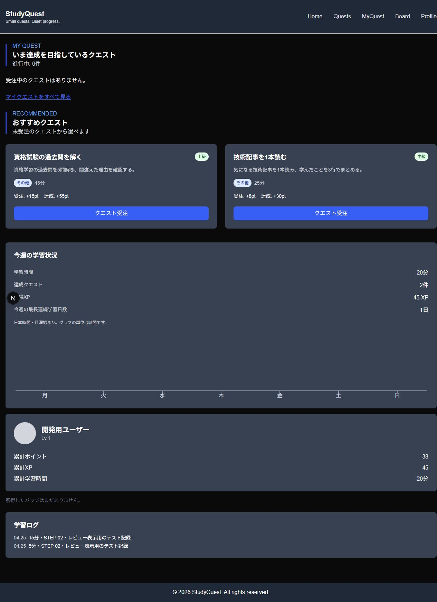
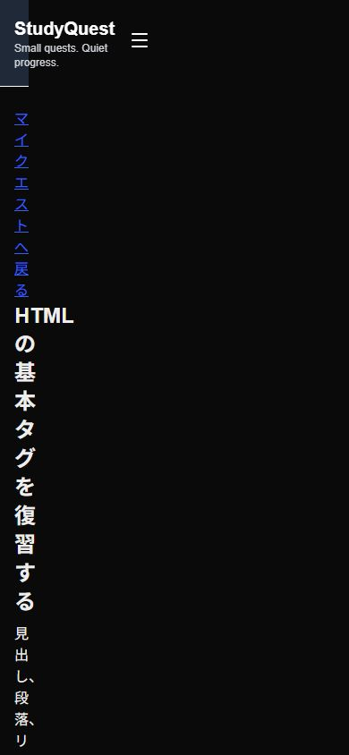
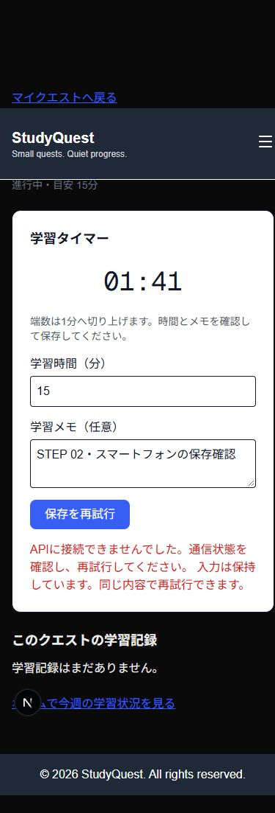

# STEP 02の確認記録

確認日: 2026-10-05。対象版: `13792d4`（`feature/64-step02-learning-flow`）。この作業ブランチでの結果であり、developへのマージ、本認証、本番配置とは区別する。

## レビュー順

1. `ac83bb8`: 学習ログGET、再送キー、同時保存、週間の日本時間境界、OpenAPI、APIテスト。
2. `13792d4`: マイクエスト→タイマー→保存、週間・プロフィール・ログの実データ表示。
3. この確認記録とHTML進捗表。既存PR #61のコミットをこのブランチに取り込み、元のPR・ブランチを直接変更せず導線を完成させた。

## 検証結果

| 確認 | 結果 |
| --- | --- |
| `pnpm install --frozen-lockfile` | pnpm 10.13.1 / Node 22.15.1。lockfile変更なし |
| `pnpm format:check` / `pnpm biome:check` | 成功 |
| `pnpm lint:web` / `pnpm typecheck:web` / `pnpm build:web` | 成功。新しい一覧・学習ルートも生成 |
| `pnpm check:api` | 型検査・ビルド成功 |
| `pnpm test:api` | 12件成功。入力異常、無効な日付、GET障害時にDB詳細を出さないことを確認 |
| `pnpm test:api:db` | 専用PostgreSQL 16で18件成功。migrationとの差異なし |
| PC 1280×900 / スマートフォン幅390×844 | 下記の操作成功。横はみ出しなし |

DBテストでは、14分で未達成・1分追加で達成、同時に8分ずつ保存しても達成、同一UUIDの同時保存・再送でログ/活動/報酬が1回、内容の変更・別ユーザーのキーで409、キャンセル済みの拒否を確認。GETは本人のみ・空配列・日時/IDの降順。週間は日本時間の日付/週境界、本人分離、空週7日分、完了数とXPを確認した。

## 画面で試す

ローカルセットアップ後、APIとWebを起動する。現在は開発用ユーザーである。

1. `/quests`またはホームの実在するおすすめを受注する。
2. `/my-quest`の「学習する」で対象のタイマーへ移動する。
3. 「開始」→「一時停止」で表示が止まることを確認し、「再開」→「終了して記録」。
4. 端数を1分へ切り上げた時間とメモを確認する。閾値を短時間で試す場合は分数を修正できる。
5. **作業用プレビューだけで**APIを止めて保存し、入力保持と「保存を再試行」を確認。API復旧後に同じボタンで再送する。
6. 対象の記録・達成状態とホームの週間時間・XPを見る。記録画面を読み直してもDBの記録が表示される。
7. API停止中の別タブで一覧の取得失敗を確認し、復旧後の「再試行」で戻る。検証DBの空状態ではクエスト一覧へのリンクを確認する。

実操作では5分の習慣クエストと15分のHTMLクエストを受注し、保存分数を画面で5分・15分へ修正して閾値を検証。PC・モバイルの保存失敗から復帰し、画面/API/DBで20分・2件達成・45XP・ログ2件が一致した。15分の実時間待機は行っていない。

最終ホーム画像は、空状態テスト後にAPIから同じ20分・45XPのテスト記録を投入したもの。利用者の実績・本番データではない。

## 環境と限界

- Web `http://localhost:3300`、API `http://localhost:3301`、loopback限定。接続先とCORSを指定した。
- この作業で作成した専用コンテナを使用。既存テストDBは認証ブランチとの構造差異を検出した時点で停止し、既存データを変更せず新しいテストDBで確認した。
- DBモデル・migration・seed変更なし。新しいプレビューDBへ既存migrationとseedを適用。
- 未保存の時間・入力の保持はその画面を保っている間。離脱・再読み込み後の下書き復旧は提供しない。
- 実スマートフォン、長時間離席・OS休止、本認証の二人分離、Google OAuth、本番配置は未確認。
- 外部登録・課金・サイト公開は行っていない。PRはユーザーの確認までOpenで維持する。

## PRとCI

[PR #65](https://github.com/IP-GACHI-UT/StudyQuest/pull/65)はOpen。4f81589のquality・web・api-static・api-dbは全成功。[APIと実DBの実行](https://github.com/IP-GACHI-UT/StudyQuest/actions/runs/37228733918)、[quality](https://github.com/IP-GACHI-UT/StudyQuest/actions/runs/37228733947)、[Web](https://github.com/IP-GACHI-UT/StudyQuest/actions/runs/37228733978)。マージはユーザーが確認後に実施する。
