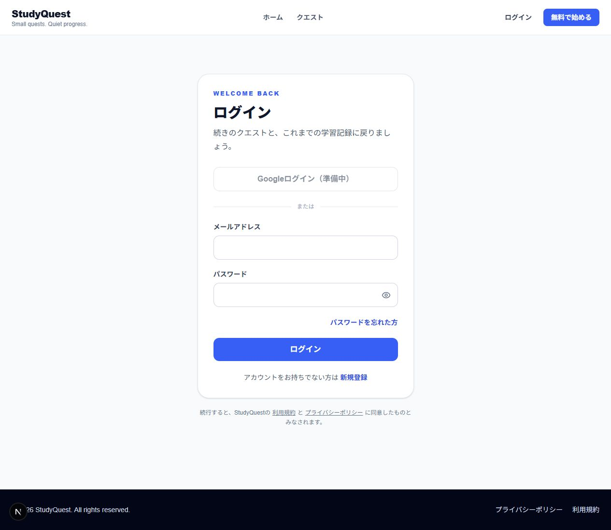
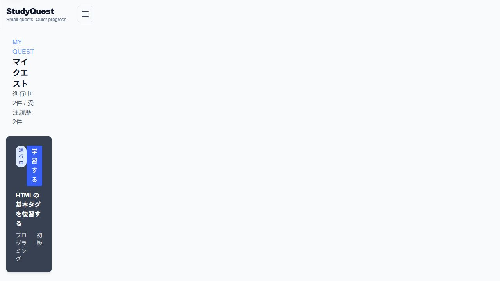
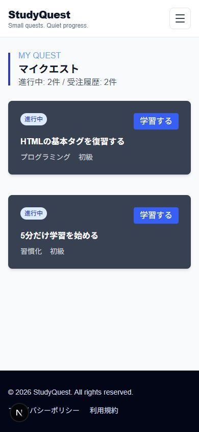
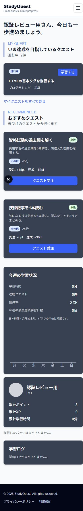

# STEP 03の確認記録

確認日: 2026-10-05。対象版: `b9d3ca8`（`feature/66-step03-auth-integration`）。STEP 02のPR #65に依存する作業ブランチでの結果。developへのマージ、外部サービス設定、本番配置は未実施。

## 取り込みとレビュー順

1. 既存PR #55 → #56 → #57 → #58 → #59 → #60の順の認証スタックを確認し、最終ブランチ `codex/auth-e2e` の `6149ddb` をローカルで取り込んだ。元のPR・共有ブランチは変更していない。
2. `prisma/schema.prisma` と既存の認証migration、`docs/authentication.md`、`apps/api/src/lib/auth.ts`。Better Auth・DBセッション・メール確認・再設定・レート制限の契約を確認する。
3. `apps/api/src/routes/study-logs.ts` と他の保護API。STEP 02のログGET・再送防止・JST集計を残し、セッションの本人IDへ統一した。
4. 保護レイアウト、`proxy.ts`、`lib/api.ts`、タイマー、ログイン画面。学習ダッシュボードは `/dashboard` へ移し、公開ホームは紹介画面とした。固定のクエスト表示には「クエストの例」と明記した。
5. APIの認証・実DBテストと `e2e/authentication.spec.ts`、この記録、HTML進捗表。

## 検証結果

| 確認 | 結果 |
| --- | --- |
| `pnpm install --frozen-lockfile` | pnpm 10.13.1 / Node 22.15.1。認証スタックのlockfileで成功 |
| `pnpm prisma:validate` / `pnpm prisma:generate` | 成功 |
| `pnpm format:check` / `pnpm biome:check` | 成功 |
| `pnpm lint:web` / `pnpm typecheck:web` / `pnpm build:web` | 成功。保護された4画面は動的ルートとして生成 |
| `pnpm check:api` / `pnpm test:api` | 型・ビルド成功、単体13件成功 |
| `pnpm test:api:db` | 専用PostgreSQL 16、24件成功。認証migration適用、schemaとの差異なし |
| `pnpm test:e2e` | ローカルMailpit・Chromiumで全3件成功 |
| PC / スマートフォン幅390×844 | 保護画面からログインへ遷移、本人の2件の受注一覧、モバイルメニューとダッシュボード遷移を確認。横はみ出しなし |

単体テストの入力検証11件は認証ミドルウェアをstubにし、入力契約だけを検証する。実認証の判定は残る単体2件、実DB、E2Eで確認した。DBでは未ログインの全個人APIのGET/POSTを401、他人のクエストへの保存を400、他人の再送キーを409で拒否。偽の `userId` を受注本文・ログ本文・取得queryへ渡しても、ログ・プロフィール・XPはセッションの本人だけに紐づく。

E2Eでは確認メールからの登録完了、ログイン・ログアウト、保護画面、外部URLの `next` 拒否、パスワード再設定、6回目のログイン試行の429を確認した。さらに二つの分離したChromium contextでAの記録がBへ見えないことを確認。Aのセッションを専用テストDBで期限切れにし、タイマー保存の401後も時間・メモを保持し、別タブの再ログイン後に同じ再送キーで1件だけ保存・達成した。Originなしの書き込みは403で拒否され、正しいOriginでは受注できた。

## 手元で確認する

通常のセットアップは [認証手順](../../authentication.md) に従う。

1. 未ログインで `/my-quest` または `/study/{questId}` を開き、`/login?next=...` へ移る。
2. `/signup` でローカルのテストメールアドレスを登録し、Mailpitの確認メールのリンクを開く。
3. `/quests` から受注し、マイクエスト→学習→保存→ダッシュボードで自分の結果を確認する。
4. 別のブラウザープロファイルで別ユーザーとして登録し、一人目の受注・学習メモが見えないことを確認する。
5. 再設定メールでパスワードを変更すると、既存セッションが無効になることを確認する。期限切れ時の保存復帰の再現は専用DBを使うE2Eで行う。

このPCのレビュー用URLは `http://localhost:3400`。専用DBに用意したダミーアカウント `review-auth@example.com` とテスト用パスフレーズ `correct horse battery staple 2026` でログインできる。このアカウントはレビュー環境だけのもの。本番や実サービスでは使用しない。画像の受注2件はレビュー用fixtureで、実利用者の実績ではない。

## 未確認の範囲

- Google OAuthの実登録・同一メール連携、本番SMTP、DNS、HTTPS配置、実端末は未確認。Googleボタンは既定で「準備中」。
- 規約・プライバシー文面、問い合わせ先と送信元は運営者の公開前レビューが必要。
- ブラウザー再読み込み・ページ離脱をまたぐ未保存タイマーの復元は対象外。保存失敗の復帰は画面を保持した場合に確認した。
- マージと無料βの公開は別の確認。CI結果は進捗表の独立した根拠に記録する。

## 確認画像

