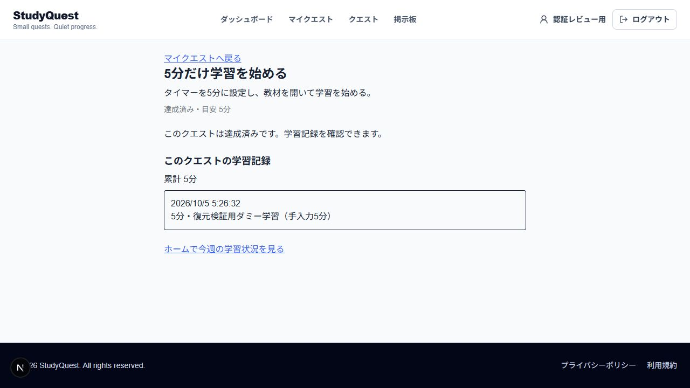

# STEP 04 公開準備・別DB復元の確認

2026-10-05 / Issue #68。アプリの基準版はSTEP 03の`e16f03e`。専用ブランチ`docs/68-step04-release-preparation`で、文書・進捗・確認画像だけを変更した。

## レビュー順

STEP 02のPR #65 → STEP 03のPR #67 → STEP 04のPR。差分の基準は`feature/66-step03-auth-integration`。元の認証PRと他メンバーのPRは変更していない。マージ・公開はユーザー確認後。

1. [release.md](../../release.md): 候補・費用上限・環境変数・実配置の残件。
2. [backup.md](../../backup.md): 復元手順、周期・保持・担当の案。
3. [beta-notice.md](../../beta-notice.md): 提供範囲・個人情報・窓口原稿。
4. [集計証拠](step04-restore-result.json)と下の画像: 別DBへの復元結果。

## 復元結果

専用ローカルPostgreSQL 16の`studyquest_preview`（port 5541）からcustom dumpを取得。別コンテナの空の`studyquest_restore`（port 5542）へ`pg_restore --exit-on-error --no-owner --no-acl`で復元。元DBは保持し、dump・認証情報はGitへ含めていない。

| 照合 | 元DB | 復元先 |
| --- | --- | --- |
| users / quests | 2 / 8 | 2 / 8 |
| user_quests / study_logs / activity_logs | 2 / 1 / 4 | 2 / 1 / 4 |
| accounts / sessions / migration履歴 | 1 / 2 / 2 | 1 / 2 / 2 |
| 総学習分数 | 5 | 5 |
| ログ・進行・活動・usersのXP/points | 一致 | 一致 |

dumpは27,841 bytes。SHA256は`198fcb473bd738320eced4da3405b2c3f758f393c06706e1a218527fc62d61bf`。hashは同一性の記録で、暗号化ではない。

APIを復元DBへ切り替えて再起動し、同じ実セッションでログ5分・達成1件・15XP・18points・進行中1件を確認。5分は手入力値で、5分間待った試験ではない。ユーザー・メール・メモはすべてダミー。

元DBの保存後:

別DBへの切り替え後:

## 検証・限界

- 成功: dump取得、別の空DBへ復元、集計・内容hash比較、復元先へAPI接続を変更した画面確認。
- 文書: 公式情報の費用・商用条件、参照リンクと正本の整合、進捗HTMLの再生成・一致を確認。
- `pnpm progress:build` / `progress:check` / `format:check` / `biome:check`成功。依存準備は`CI=true pnpm install --frozen-lockfile --ignore-scripts`。進捗HTMLで新しい配置文書の開閉と同梱本文を確認し、幅828/390で横あふれなし（文書幅813/375）。
- アプリコード・DB schema・migration・seed・依存関係は未変更。文書変更のための全アプリ再実行は省略し、前提となるSTEP 03の所定チェック・CI成功を参照する。
- 未確認: クラウド配置、Functions入口、HTTPS、proxyの実IP、本番SMTP・Google、定期取得・暗号化保管、担当者、正式条件、マージ・公開。

`info@gtowell.dev`は窓口候補。公開MXがGoogle向けであることは読み取り確認したが、エイリアス/グループ設定と外部受信・返信は未確認。DNS変更・メール送信は実施していない。

STEP 04は部分的な準備完了。実配置が必要な04.1.1・HTTPSが必要な04.1.2は完了にしない。外部確認を待ちながらSTEP 05の独立した準備へ進む。
